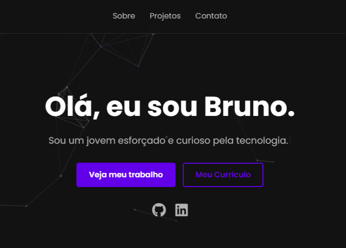

# Portfólio Pessoal de Bruno Henrique

[](https://brunohen94-portfolio.vercel.app/)

Este é o repositório do meu portfólio pessoal, um site estático moderno e totalmente responsivo construído para apresentar minhas habilidades, projetos e informações de contato a recrutadores e à comunidade tech.

## 🖼️ Preview do Projeto



## ✨ Funcionalidades Principais

Este portfólio vai além de um simples HTML/CSS e inclui diversas funcionalidades de alto nível para demonstrar proficiência técnica e atenção à experiência do usuário:

* **🌎 Internacionalização (i18n):** Suporte completo para múltiplos idiomas (Português e Inglês) usando a biblioteca `i18next`, o padrão da indústria para tradução em JavaScript.
* **🌌 Fundo Dinâmico:** Um fundo de partículas interativo e sutil, construído com `tsParticles`, que adiciona um visual "tech" premium sem distrair o usuário.
* **✒️ Efeito "Máquina de Escrever":** Animação de digitação no subtítulo da home, implementada com `typewriter-effect`, que é integrada ao sistema de tradução.
* **📱 Design Responsivo:** Layout que se adapta perfeitamente a desktops, tablets e celulares.
* **👁️ Animações de Rolagem:** Efeitos de "reveal" (aparecimento suave) em todas as seções, utilizando a `Intersection Observer API` para melhor performance.
* **📬 Formulário de Contato Funcional:** Integração com o **Formspree** para recebimento de mensagens de forma profissional, sem a necessidade de um back-end.
* **🔼 Botão "Voltar ao Topo":** Um botão de UX que aparece durante a rolagem para facilitar a navegação.
* **🔗 Otimização de Mídia Social (Meta Tags):** Meta tags Open Graph (OG) que garantem um preview rico e profissional ao compartilhar o link no LinkedIn, WhatsApp e outras redes.

## 🛠️ Tecnologias Utilizadas (Neste Projeto)

O portfólio em si foi construído limpo e moderno, utilizando:

* **HTML5**
* **CSS3:** (Layouts com Flexbox e Grid, Variáveis CSS, Media Queries)
* **JavaScript (ES6+):** (Manipulação do DOM, Event Listeners, `Intersection Observer`)

### Bibliotecas Externas

* **i18next:** Para a funcionalidade de múltiplos idiomas (i18n).
* **tsParticles:** Para o fundo de partículas animado.
* **Typewriter-Effect:** Para o efeito de digitação.
* **Font Awesome & DevIcon:** Para a iconografia profissional de redes e habilidades.

## ⚙️ Como Executar Localmente

Como é um projeto estático, não há necessidade de build ou instalação de pacotes.

1.  Clone o repositório (substitua pela URL do seu repositório):
    ```bash
    git clone [https://github.com/brunohen94/portfolio.git](https://github.com/brunohen94/portfolio.git)
    ```
2.  Entre na pasta do projeto:
    ```bash
    cd portfolio
    ```
3.  Abra o arquivo `index.html` diretamente no seu navegador.

## 📬 Contato

**Bruno Henrique**
* **LinkedIn:** [https://www.linkedin.com/in/brunohen94/](https://www.linkedin.com/in/brunohen94/)
* **Email:** brunohenriquerf94@gmail.com
